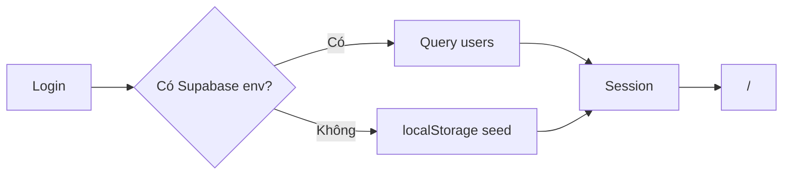

# Auth & phiên làm việc

## Đăng nhập
- Form User / Mật khẩu trên `/login` (hoặc redirect khi chưa session).
- Seed: `phuongdm`/`admin123` (B admin), `tinhtv`/`pm123`, `hienth`/`mem123`, `chulm`/`a123` (A).
- Session: `localStorage` keys `outsrc_user`, `outsrc_perms`.
- Sau login → `POST_LOGIN_ROUTE` = `/`.

## Phe & quyền
| Trường | Ý nghĩa |
|--------|---------|
| `phe` | `ben_a` \| `ben_b` |
| `role` | `admin` \| `pm` \| `member` |
| `perms` | cờ `q_*` (sửa/xóa DA, lập KS, chia nội bộ, admin…) |

## Guard
- `/tai-chinh-noi-bo`, `/chia-noi-bo`: chỉ Bên B + `q_chia_noi_bo`
- `/quan-ly-he-thong`: `q_admin` hoặc `q_system_log`

## Lỗi kết nối Supabase
- Key sai / thiếu → thông báo hướng dẫn copy lại **anon public** JWT (`eyJ…`) vào env, restart/redeploy.
- Client chuẩn hóa key: bỏ prefix copy nhầm trước `eyJ`.

