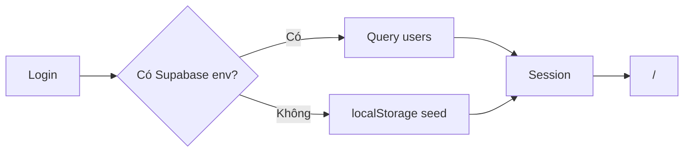

# Auth & phiên làm việc

## Đăng nhập
- Form User / Mật khẩu trên `/login` (hoặc redirect khi chưa session).
- Seed (`src/lib/seedUsers.js`): `phuongdm`/`admin123` (B admin), `tinhtv`/`pm123` (PM), `hienth`/`a123` (A, id `u-mem`), `chulm`/`a123` (A demo). Member thật tạo trên QLHT.
- Session: `sessionStorage` keys `outsrc_user`, `outsrc_perms`.
- Cột `bat_doi_mk` (SQL `020`): =1 → sau login ép `/tai-khoan` đổi MK; sau đổi =0 và đăng nhập lại.
- Tạo user / Admin đặt lại MK → `bat_doi_mk=1`.
- API: `POST /api/auth/login`, `POST /api/auth/change-password`.
- Sau login → `/tai-khoan` nếu bắt đổi MK, không thì `POST_LOGIN_ROUTE`.

## Phe & quyền (ma trận đã enforce UI)
Nguồn: `docs/Phan_quyen_OUTSRC.md` · `SEED_ROLES` / `resolveRolePerms` (`rolePerms.js`) · SQL `019`.
Login và «Xem quyền» **ưu tiên ma trận trong code** (tránh DB lệch).

| Hạng mục | Admin | PM | Member | Bên A |
|----------|:-----:|:--:|:------:|:-----:|
| QLHT / CRUD user | Có | Không | Không | Không |
| Tạo/sửa/xóa DA metadata | Có | Không | Không | Không |
| Xem danh sách DA | Mọi DA | Mọi DA | Mọi DA | **Chỉ DA trong `ben_a_user_ids`** |
| Lập/XB KS | Có | Có | Có (=PM) | Ẩn khối KS |
| Upload hồ sơ | Có | Có | Có | Chỉ xem |
| Xóa file upload | Mọi file | Chỉ file mình up | Chỉ file mình up | Không |
| Sửa sổ A↔B / nhận TU | Có | Chỉ xem | **Không xem** | Chỉ xem (DA mình) |
| Tài chính nội bộ | Sửa | **Chỉ xem** | **Không** | Ẩn |

Helper: `menuAccess.js` — `filterDuAnForUser`, `canSeeTaiChinhAb`, `canXoaHoSoFile`, `canSuaTaiChinhAb`, …

## Guard path
- `/tai-chinh` (không `/tai-chinh-noi-bo`): `canSeeTaiChinhAb` (Member B ẩn)
- `/tai-chinh-noi-bo`, `/chia-noi-bo`: Admin + PM (`canSeeChiaNoiBo`); sửa chỉ Admin (`canSuaChiaNoiBo`)
- `/quan-ly-he-thong`: `q_admin` hoặc `q_system_log`
- `/nhap-du-an`: `q_sua_du_an` (Admin)

## Lỗi kết nối Supabase
- Key sai / thiếu → thông báo hướng dẫn copy lại **anon public** JWT (`eyJ…`) vào env, restart/redeploy.
- Client chuẩn hóa key: bỏ prefix copy nhầm trước `eyJ`.

