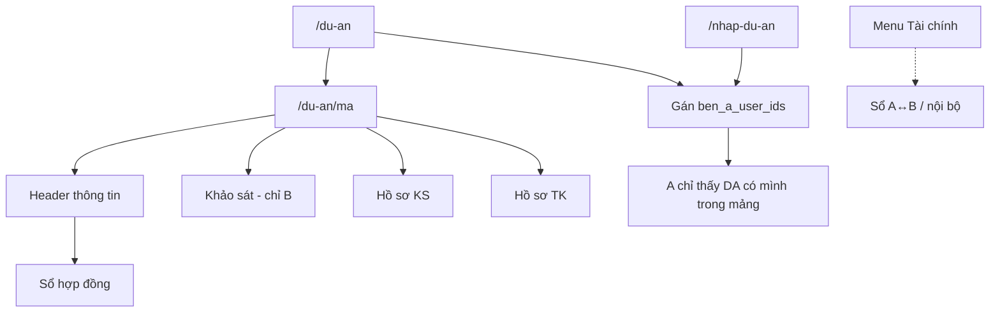

# Dự án — danh mục & workspace

## Danh mục `/du-an`
- Liệt kê DA; tạo mới (Admin); cột **Bên A** chỉ Admin thấy (`ben_a_user_ids`).
- Click → `/du-an/[ma]`.
- Sửa DA: **bắt buộc** ≥1 tài khoản Bên A (nhiều người = nhóm).
- Bên A: chỉ DA gắn mình; ẩn cột Bên A / thao tác sửa-xóa.

## Gán Bên A (thống nhất)
- **ID:** danh sách `nguoi_dung.id` (`phe=ben_a`) → `du_an.ben_a_user_ids` (jsonb mảng).
- **1 người hoặc nhóm:** dropdown đa chọn + tìm kiếm; mỗi người trong list đều thấy DA.
- Cột legacy `ben_a_user_id` = phần tử đầu (đồng bộ khi lưu). SQL: `021_ben_a_user_ids.sql`.
- **Tạo DA** (`/nhap-du-an`) / **Sửa DA**: bắt buộc ≥1 tài khoản Bên A; **Cấp điện áp chung** bắt buộc (220kV / 110kV / Trung áp 22–35kV / Hạ áp 0.4kV / Trung Hạ áp 0.4–35kV), không mặc định.
- **Lọc:** `filterDuAnForUser` — user A thấy DA nếu id của họ nằm trong mảng.
- Không nhầm với chữ «Bên A» trên HĐ (tên pháp lý).

## Workspace `/du-an/[ma]`
Các khối chính:

1. **Header thông tin chung** — CĐT, địa điểm, Hợp đồng (mở sổ), Giao A / quy mô, TMĐT, Giá trị tư vấn; hiện tên Bên A nếu đã gán.
2. **Sổ hợp đồng** (overlay) — `?action=hop_dong` hoặc bấm mục Hợp đồng; cần Supabase + SQL `008`–`018`.
3. **Khảo sát** — Bên B: module stub NVKS→…→NT (Lập / XB). **Bên A:** cùng khối, **chỉ xem** trạng thái / hồ sơ đã có (`canLapKs` = false).
4. **Hồ sơ khảo sát / thiết kế** — folder chuẩn + tùy chọn (Bên B: `+` / đổi tên / xóa); View lưới·danh sách·chi tiết.
   - **Upload:** kéo-thả hoặc chọn nhiều file → Supabase bucket `ho_so` (SQL `024`); dev không env → IndexedDB.
   - **Mở file:** bấm tên file (gạch chân).
   - **Xóa:** Admin mọi file upload; PM/Member chỉ file **do mình** tải (`canXoaHoSoFile`); không xóa xuất bản.
5. **Tài chính** — không còn trên workspace; dùng menu **Tài chính** / **Tài chính nội bộ**.

## Trạng thái DA (gợi ý)
Nháp → Triển khai → Giao tuyến → Hoàn thành / Tạm dừng.

