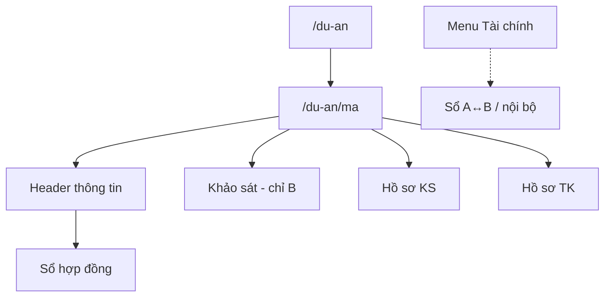

# Dự án — danh mục & workspace

## Danh mục `/du-an`
- Liệt kê DA; tạo mới (Bên B / quyền sửa).
- Click → `/du-an/[ma]`.

## Workspace `/du-an/[ma]`
Các khối chính:

1. **Header thông tin chung** — CĐT, địa điểm, Hợp đồng (mở sổ), Giao A / quy mô, TMĐT, Giá trị tư vấn.
2. **Sổ hợp đồng** (overlay) — `?action=hop_dong` hoặc bấm mục Hợp đồng; cần Supabase + SQL `008`–`018`.
3. **Khảo sát** — chỉ Bên B: module stub NVKS→…→NT. Bên A: ẩn khối này.
4. **Hồ sơ khảo sát / thiết kế** — folder chuẩn + folder tùy chọn (Bên B: `+` / đổi tên / xóa); View lưới·danh sách·chi tiết; upload trong folder.
5. **Tài chính** — không còn trên workspace; dùng menu **Tài chính** / **Tài chính nội bộ**.

## Trạng thái DA (gợi ý)
Nháp → Triển khai → Giao tuyến → Hoàn thành / Tạm dừng.

