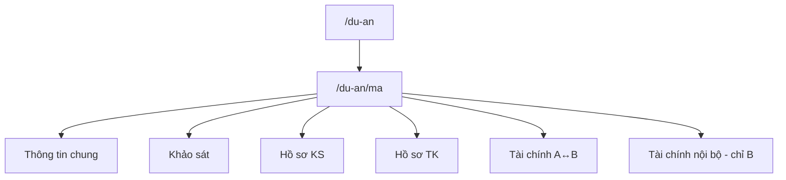

# Dự án — danh mục & workspace

## Danh mục `/du-an`
- Liệt kê DA; tạo mới (Bên B / quyền sửa).
- Click → `/du-an/[ma]`.

## Workspace `/du-an/[ma]`
Các khối chính (chung A+B trừ ghi chú):

1. **Thông tin chung** — CĐT, quy mô, GT tư vấn, % phần B…
2. **Khảo sát** — Bên B: module stub (NVKS/PAKTKS/BCKS/NT/NK) → Save → Publish. Bên A: chỉ status.
3. **Hồ sơ khảo sát** — XB từ module + upload tay (mặt cắt, mặt bằng…).
4. **Hồ sơ thiết kế** — upload only.
5. **Tài chính A↔B** — tạm ứng / thanh toán / còn lại (theo công thức 25%/30%/giao tuyến).
6. **Tài chính nội bộ** — chỉ hiện với Bên B.

## Trạng thái DA (gợi ý)
Nháp → Triển khai → Giao tuyến → Hoàn thành / Tạm dừng.

