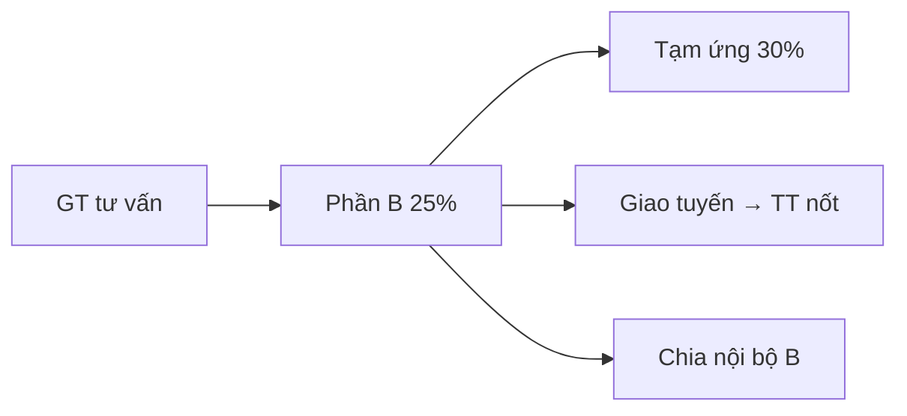

# Tài chính A↔B và nội bộ B

## Công thức A → B (mặc định, chỉnh theo DA)
1. Căn cứ = GT HĐ tư vấn hoặc PAĐT tạm tính
2. Phần B = **25%** × căn cứ
3. Tạm ứng triển khai = **30%** × phần B
4. Thanh toán nốt khi **giao tuyến** = phần B − đã thu

## Sổ chung `/tai-chinh`
- A và B đều xem giao dịch A↔B (tạm ứng, thanh toán, điều chỉnh).
- Không xuất hóa đơn.

## Tài chính nội bộ `/tai-chinh-noi-bo`
- Chỉ Bên B: % / số tiền chia trong team.
- Menu ẩn với `phe=ben_a`.
- Alias cũ: `/chia-noi-bo`.

