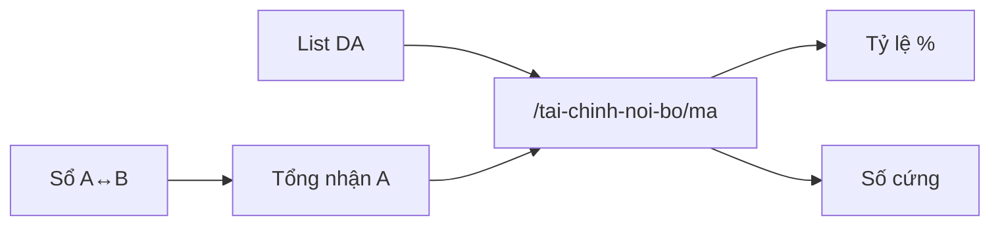

# Tài chính A↔B và nội bộ B

## Công thức A → B
1. **Căn cứ GTV** = cột Hợp đồng nếu > 0; không thì PAĐT (có thể điền **sau** khi đã tạm ứng).
2. Phần B = **25%** × căn cứ.
3. **Tạm ứng L1:** nhập tay được ngay cả khi chưa có GTV; đã có GTV → **gợi ý 30%** phần B (vẫn sửa). Nhập xong → popup nhận (ngày + bill).
4. L2 / L3 / thanh toán: nhập tay; TT gợi ý = phần B − đã thu (**cấn trừ dần** cho đủ 25%).
5. Khi `tam_ung_lan1_khoa` → khóa số L1 đã chi; PAĐT/HĐ vẫn sửa được để cập nhật GTV muộn.

## Sổ chung `/tai-chinh`
- Bảng: STT · Tên DA · TMĐT · PAĐT · HĐ · phần B · TU L1/2/3 · Thanh toán · Ghi chú.
- A và B đều xem; sửa sổ / nhận TU chỉ Admin (`q_admin`).
- Không xuất hóa đơn.

## Tài chính nội bộ `/tai-chinh-noi-bo`
- Chỉ Bên B. Menu ẩn với `phe=ben_a`.
- **Hai tầng:** list DA → bấm vào `/tai-chinh-noi-bo/[ma]` để chia.
- **Chốt hiện tại:** gộp cả dự án → **chia 1 lần** trên **tổng đã nhận từ A** (đọc sổ A↔B).
- Hai chế độ: **tỷ lệ %** hoặc **số cứng** (tổng = tổng nhận A).
- Phần B theo GTV chỉ để đối chiếu.
- Chưa làm: ứng nội bộ B↔B; chia theo từng đợt nhận.

