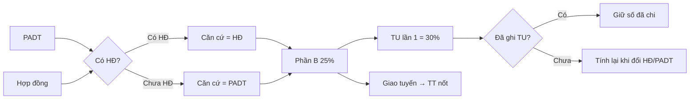

# Tài chính A↔B và nội bộ B

## Công thức A → B
1. **Căn cứ GT tư vấn** = cột Hợp đồng nếu &gt; 0; không thì PADT (PAĐT tạm tính).
2. Phần B = **25%** × căn cứ.
3. **Tạm ứng lần 1** = **30%** × phần B — **tự ghi sổ** khi nhập/sửa PADT hoặc HĐ.
4. Khi `tam_ung_lan1_khoa` → **khóa** số đã chi (không đổi dù cập nhật HĐ).
5. Thanh toán nốt khi **giao tuyến** = phần B − đã thu.

## Sổ chung `/tai-chinh`
- Bảng: STT · Tên DA · TMĐT · PADT · HĐ · TU lần 1/2/3 · Thanh toán · Ghi chú.
- A và B đều xem; sửa PADT/HĐ cần quyền sửa dự án.
- Không xuất hóa đơn.

## Tài chính nội bộ `/tai-chinh-noi-bo`
- Chỉ Bên B: % / số tiền chia trong team.
- Menu ẩn với `phe=ben_a`.

