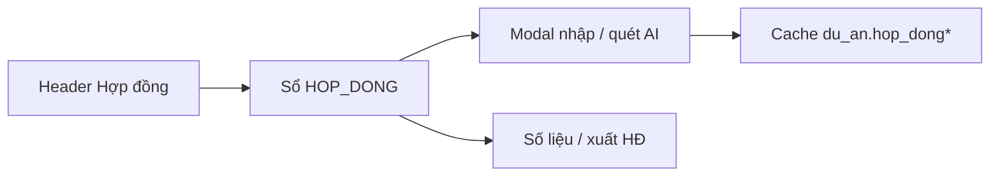

# Sổ hợp đồng

## Mục đích
Quản lý HĐ tư vấn CĐT (và thầu phụ) gắn mã dự án / giai đoạn — nguồn sự thật; cột `du_an.hop_dong*` chỉ là cache hiển thị.

## Vào sổ
- Workspace DA → bấm khối **Hợp đồng** trên header, hoặc
- Deep link `/du-an/[ma]?action=hop_dong`.

## Thao tác chính
1. **+ HĐ chính** / **+ HĐ thầu phụ** / phụ lục·điều chỉnh / ký lại.
2. Upload PDF + **Quét AI** (cần `GEMINI_API_KEY`) → rà soát bảng giá trị → Lưu.
3. Gắn phạm vi giai đoạn (mã DA).
4. Số liệu thực hiện / xuất HĐ (trên sổ); Import Excel (Admin).

## Tiền đề kỹ thuật
- Supabase: chạy `scripts/sql/008` … `018` (gộp thiếu: `018_missing_hop_dong_bundle.sql`).
- PDF: bucket `pdfs_giao_a` (cùng Giao A).
- Không dùng bảng `DANH_MUC_DA` (ksnpsc) — OUTSRC dùng `du_an`.

